# 1. Firsts tests - Complete empty terraform directory 👀️

Directory:

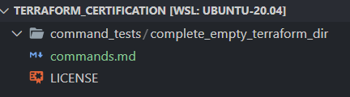

## Let's test some commands and see the behaviors ❤️

Version used int the examples:

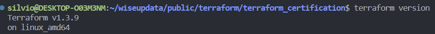

#### The following commands do not generate errors!

```
terraform validate
```

* zero errors!

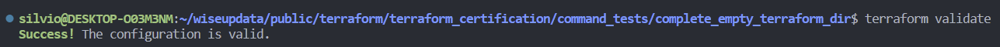

```
terraform init
```

* No errors!

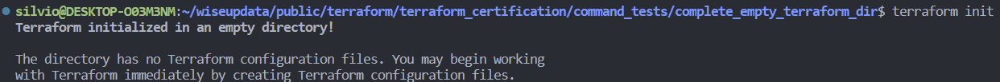

```
terraform show
```

* No errors!

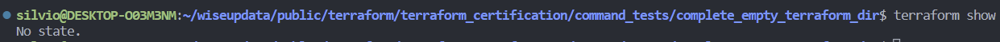

#### The following commands generates errors!👀️

```
terraform plan
```

* Generate error!
* Not creates the terraform.tfstate

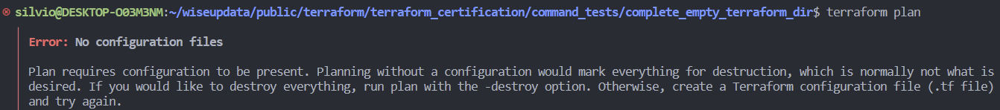

```
terraform apply
```

* Generate errors
* Not creates the terraform.tfstate

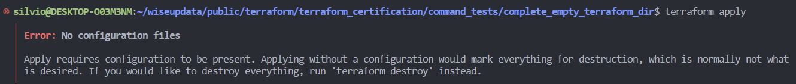

#### The following command do not generate errors and has a very interesting behavior.🚀️

```
terraform destroy
terraform apply -destroy
```

* No errors
* Creates the terraform.tfstate

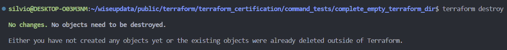

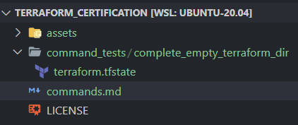

# 2. New tests - Single resource no providers

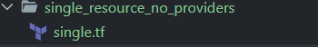

#### Let's test the same commands, but now they will return errors! 👀️

```
terraform validate
```

- This time the validate return a error, different when the directory was empty

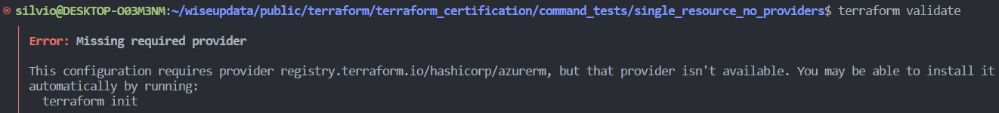

```
terraform destroy
```

- Destroy also does not work anymore.

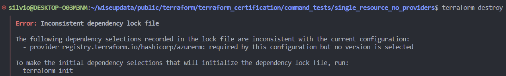

#### Let's pay attention for the following code. Now the Azure provider will be installed, but we did not define nothing apart the resource! 👀️

check the directory before the init:


single.tf

```
resource "azurerm_resource_group" "this" {
  name     = "rg-single-resource"
  location = "ukwest"
}
```

#### Let's run the init with this only file, only config.👀️

```
terraform init
```

- The plugging it will be download automatic!
- The lock file will be created automatic!

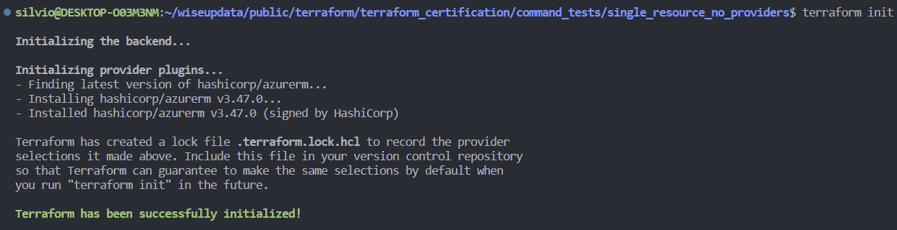

#### Let's look to the directory.

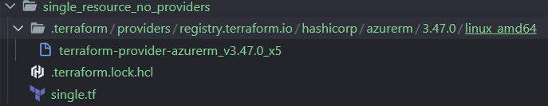

> Oh, everything look good, evedon we do not have any provider blocks, or required_proders, nothing.😕

Let's try to created the resource group in Azure, just to let you know we are logged with  `az cli`

```
terraform apply -auto-approve
```


- Okay, for Azure a feature block is required, lets add it
