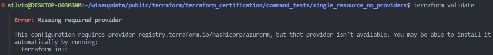
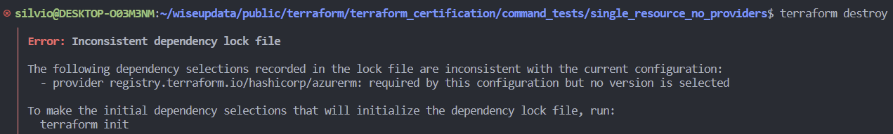
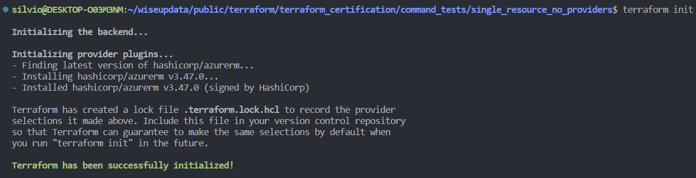
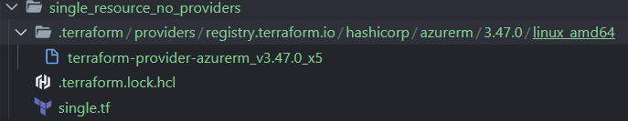
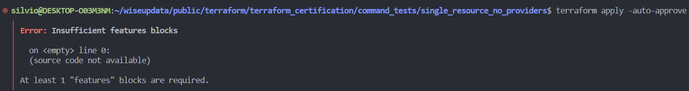
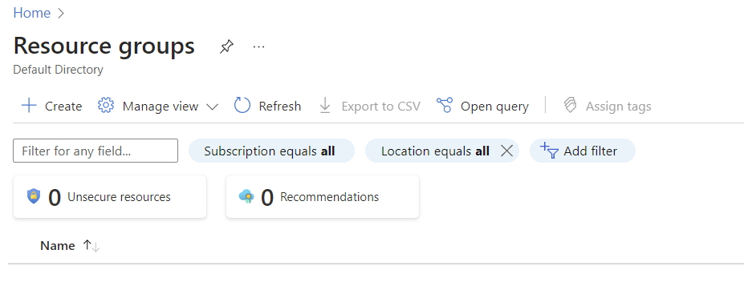
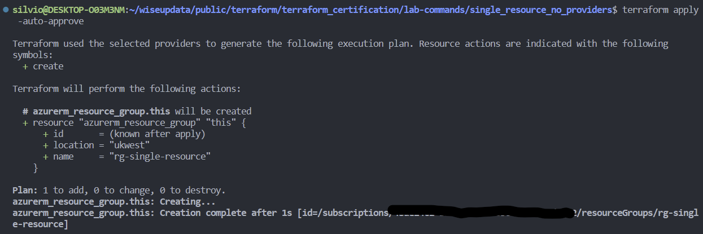

# 2. New tests - Single resource no required_providers block


#### Let's test the same commands, but now they will return errors! 👀️

```
terraform validate
```

- This time the validate return a error, different when the directory was empty



```
terraform destroy
```

- Destroy also does not work anymore.



#### Let's pay attention for the following code. Now the Azure provider will be installed, but we did not define nothing apart the resource! 👀️

check the directory before the init:


single.tf

```
resource "azurerm_resource_group" "this" {
  name     = "rg-single-resource"
  location = "ukwest"
}
```

#### Let's run the init with this only file, only config.👀️

```
terraform init
```

- The plugging it will be download automatic!
- The lock file will be created automatic!



#### Let's look to the directory.



> Oh, everything look good, evedon we do not have any provider blocks, or required_proders, nothing.😕

Let's try to created the resource group in Azure, just to let you know we are logged with  `az cli`

```
terraform apply -auto-approve
```



> Okay, for Azure a feature block is required, lets add it

new file `versions.tf`

```
provider "azurerm" {
  features {}
}
```

> Note that we didn't declare the required_providers and anything.

#### Let's try to created the resource group in Azure again!

It not exists yet! Take a look!



```
terraform apply -auto-approve
```




- Resource created!
- terraform.tfstate created!
- We didn't create the terraform block, netheir the required providers!

```
# Not mandatory blocks!
# terraform {
#   required_version = "~>1.0"
#   required_providers {
#     azurerm = {
#       source  = "hashicorp/azurerm"
#       version = "~>3.3"
#     }
#   }
# }
```

#### Let's clean every thing!

```
terraform destroy -auto-approve
```

```
rm -Rf ./terraform.*
rm -Rf ./.terraform
```
